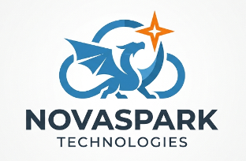

# The NovaSpark Technologies Journey
## A Fictitous Company used for our Cloud Journey

**Purpose:** This document tracks the NovaSpark story from Week 1 through the final project in both courses. Use it as a reference when writing new lecture content, lab guides, or slide speaker notes to ensure the narrative thread stays consistent and the company's "state" at any given week is plausible.

---

## The Company and Cast

**NovaSpark Technologies** is a small but growing software company building internal developer tools and operational services. Students are framed as a cloud engineer who just joined the team. The company is fictional but realistic — it has the pressures, constraints, and technical debt of a real startup.

| Character | Role | Voice / Concern |
|-----------|------|----------------|
| **Janet** | CTO | Architecture and business outcomes. "Is this the right solution?" She cares about whether the technical choices will hold up as the company grows. Introduces new requirements and challenges. |
| **Ben** | Engineering Manager | Delivery, cost, and operations. "Will this break at 3am, and how much will it cost?" He's the one who has to explain the AWS bill to Janet and keep the team from over-engineering. |
| **Linda** | SRE / Senior Engineer | Reliability, security, and operational correctness. "Who gets paged when this breaks?" She pushes back on anything that isn't production-grade. Often the voice that introduces failure modes and security concerns. |

---

## NovaSpark Internal Asset Naming — Dragon Theme

NovaSpark's internal tools, services, and infrastructure assets use dragon-themed names as a subtle nod to Drexel's mascot. 


| Asset type | Name | Notes |
|------------|------|-------|
| Monitoring / status dashboard | **Draken** | NovaSpark's internal status dashboard that consumes the status API students build |
| Internal CLI tool | **Ember** | The command-line tool NovaSpark engineers use to interact with internal services |
| CI/CD pipeline | **Forge** | Where NovaSpark's infrastructure changes are reviewed and deployed |
| Alerting system | **Singe** | The thing that pages Linda at 3am |
| Data lake / log archive | **Vault** | Where NovaSpark's cold S3 logs live |
| Staging environment | **Wyvern** | NovaSpark's pre-production environment |
| Load testing tool | **Scorch** | Used in the serverless performance analysis lab |


**Reserved / not yet assigned:** Fafnir, Nidhogg, Vermithrax, Cinder, Talon, Gale — available for future services or project options that can support your coursework.

---

## The Architecture NovaSpark Ends Up With

By the end of both courses, the canonical NovaSpark architecture is:

```
Internet → API Gateway (HTTP API)
               ↓
           Lambda (Python)
               ↓
           DynamoDB (persistent state)

All infrastructure defined in Pulumi (Python)
All resources in a VPC with public/private subnets
IAM roles scoped to least privilege
```

Both courses arrive at this architecture — undergrad by building it piece by piece, graduate by evaluating and justifying it. The same architecture serves as the basis for the capstone project (CS 463) and the Architecture Design Document (CS 545).

---

## The NovaSpark Cloud Journey Objective

**The problem NovaSpark has at the start of the course:** The company is growing and needs real cloud infrastructure. Right now, things are running on rented servers (or nothing at all). Janet wants to move to AWS properly — not just lift-and-shift, but build things the right way from day one.

**What "the right way" means in this course:**
- Infrastructure managed as code (no clickops, no manual configs, reproducible from scratch)
- Network architecture that isolates resources and doesn't expose private things to the internet
- Serverless where it makes sense — Lambda for compute, DynamoDB for state
- APIs that external and internal services can call reliably
- Costs that Ben can explain and predict
- Security posture that Linda can defend

**The NovaSpark "status service" thread:** The most concrete through-line in both courses is a status event service — a simple API that records when NovaSpark's internal services are healthy, degraded, or down. It starts as hardcoded data in a Lambda function (Lab 5 / CS 463 Week 7) and ends as a real DynamoDB-backed API. Janet's recurring complaint — *"hardcoded data isn't a real service"* — is the trigger that motivates the storage lecture and the project.

---

## Undergrad — Week by Week

| Week | What NovaSpark needs | Who says it | What students build | Architecture state after lab |
|------|---------------------|-------------|---------------------|------------------------------|
| **1** | A cloud engineer who can set up AWS properly. Janet introduces the company and the course arc. | Janet | AWS CLI configured, credentials from Learner Lab, identity verified with `aws sts get-caller-identity` | Nothing deployed yet — just access configured |
| **2** | Get off manual servers. NovaSpark can't keep SSHing into boxes and running commands by hand. Ben is sick of deployments that only work on one person's laptop. | Ben | EC2 + S3 + IAM role deployed with Pulumi. Website served from EC2 (P1), content moved to S3 (P2), fully automated with `user_data` — no SSH required (P3) | EC2 instance + S3 bucket + IAM role — all in Pulumi |
| **3** | A real network. Linda says NovaSpark can't keep everything in the default VPC with everything exposed. | Linda | Full VPC: public + private subnets, IGW, NAT Gateway, route tables, security groups, NACLs. Written reflection on routing decisions. **Destroyed at end of class** (NAT Gateway cost). | VPC architecture exists in Pulumi — but destroyed to save budget |
| **4** | *(Continued from Week 3)* SSH access patterns — Janet wants engineers to be able to reach private instances safely without opening ports to the internet. | Janet | Rebuild VPC, load SSH key with agent forwarding, SSH to bastion, hop to private instance, prove no public IP, test security group enforcement. **Destroyed at end of class.** | VPC rebuilt and explored — still destroyed after lab |
| **5** | No lab — lecture-heavy week covering async patterns, the deployment spectrum, and API Gateway. | — | — | No new infrastructure |
| **6** | Is NovaSpark's architecture actually "cloud native"? Janet has heard the term but wants to know if what they've built qualifies. | Janet | 12-factor app audit of everything built in Labs 2–3. CNCF landscape exploration. Written deliverables only — no AWS infrastructure. | Analysis only — architecture unchanged |
| **7** | NovaSpark needs an API that doesn't require a server running 24/7. Ben is worried about paying for EC2 when traffic is zero. | Ben | Lambda function + API Gateway deployed with Pulumi from the start (no console). Function deployed, wired to HTTP endpoint, tested with `curl`. Written reflection on tradeoffs vs. EC2. | **Lambda + API Gateway** — the foundation for the capstone project. **This lab is explicitly the starting point for the final project — do not throw it away.** |
| **8** | Is NovaSpark's architecture production-ready? Linda wants a proper evaluation before they ship anything real. | Linda | Written WAF audit of the architecture from Labs 2–5: rate each of the 6 pillars, justify with specific references to prior lab work, propose one improvement per pillar. No new AWS infrastructure. | Architecture unchanged — assessment only |
| **9** | Janet: *"What good is a status endpoint that never changes? We need to store real events."* The Lambda from Lab 5 returns hardcoded data. NovaSpark needs persistent state. | Janet | Add DynamoDB table to the Pulumi stack. Implement the `POST` route end-to-end — a real write to DynamoDB. Declare project scope. | **Lambda + API Gateway + DynamoDB** — the complete serverless stack |
| **10** | Polish week. No new requirements — just "make it actually work reliably." Ben: "I need to demo this to investors in two weeks." | Ben | Fix broken routes, add error handling (404 not 500), test all routes with `curl`. Record rough draft of demo video. | Same architecture — production-hardened |
| **11** | Final submission. | — | Video demo (`pulumi up` → 3 `curl` calls → one architectural decision explained → `pulumi destroy`). Written reflection (WAF self-assessment, what surprised you, what next). | Final state: working serverless API on AWS, fully in code, IAM least-privilege |

---

## Graduate — Week by Week

| Week | What NovaSpark needs | Who says it | What students do | Architecture / ADD state after lab |
|------|---------------------|-------------|------------------|-----------------------------------|
| **1** | Same introduction. Janet explains NovaSpark's situation. The graduate framing: students aren't just engineers executing tasks, they're advisors helping Janet make the right architectural decisions. | Janet | AWS console tour, CLI setup, billing alarm configured. Explore Free Tier dashboard. Research response: Barroso warehouse-scale computing. | Access configured. Billing alarm live ($40 threshold). No deployed infrastructure. |
| **2** | NovaSpark needs to move to IaC. Ben: "I'm tired of not knowing what changed or who changed it." Graduate framing: students don't build from scratch — they read, annotate, and justify a provided template. | Ben | Read and annotate provided Pulumi Python template (EC2 + S3 + IAM). Modify instance type and add S3 bucket. Write 1-page justification: what does the template do, and what would break if the IAM role was removed? | EC2 + S3 + IAM deployed via provided Pulumi template. **Students understand what they deployed — they didn't just run it blindly.** |
| **3** | NovaSpark's single flat network is a liability. Linda: "Everything is reachable from everywhere. One compromised instance and it's all over." Graduate framing: design the network and justify every routing decision. | Linda | Deploy provided VPC Pulumi template. Trace route tables for each subnet in the console. Draw a network diagram and write 1-page explanation of each routing decision. **Destroy at end of class** (NAT Gateway cost). | VPC architecture understood and documented. The network diagram becomes Section 2 of the ADD. |
| **4** | Janet: *"What good is a status endpoint that never changes? We need to store real events."* Ben adds: *"Whatever we use, I need to explain the cost model to the CTO at end of Q1. Pick something predictable."* Graduate framing: design the access patterns *before* touching the console. | Janet + Ben | Console-only DynamoDB — no Pulumi. Design access patterns first (written), then create the table. Enable PITR. Write RTO/RPO analysis: what is NovaSpark's recovery point if the table is corrupted right now? | DynamoDB table designed and created. **Access pattern analysis + RTO/RPO write-up becomes the storage section of the ADD.** |
| **5** | NovaSpark's status service needs a real API. Janet: "I want to be able to `curl` this and get structured data back." Graduate framing: evaluate the performance implications of what you deploy. | Janet | Deploy provided Lambda + API Gateway Pulumi template. Modify handler to return structured JSON. Test with `curl`. Write 1-page performance analysis: cold start observations + what traffic pattern would make you reconsider Lambda. | **Lambda + API Gateway** deployed. Cold start behavior documented. Performance analysis becomes the compute section of the ADD. |
| **6** | Janet: *"If the status API goes down, three downstream services don't find out for 15 minutes. We need real-time notification."* Graduate framing: redesign the architecture for async fan-out without touching AWS. | Janet | Workshop (no AWS). Design an event-driven extension: given fan-out to email + Slack + a database write, choose between SQS / SNS / EventBridge. Draw the architecture diagram, annotate component choices, justify async over sync. | No new AWS infrastructure. **Architecture diagram from this workshop is the event-driven section of the ADD.** |
| **7** | ADD due. Janet wants to see the full architecture on paper before anything else gets built. *"I need to show this to the board. One document, the whole picture."* | Janet | No Block 3 lab. Block 2 discussion (SRE Book: monitoring distributed systems). Extra time for ADD peer review. **Architecture Design Document due end of week.** | **ADD submitted** — the full NovaSpark architecture documented: VPC, Lambda, DynamoDB, event-driven extension, security posture, cost model. |
| **8** | Linda: *"The Lambda roles are too permissive. And why does the S3 bucket have public read enabled? We need to fix this before it goes anywhere near production."* Graduate framing: audit your own architecture for security gaps. | Linda | Project work session. Pulumi stack initialized, DynamoDB table defined, at least one Lambda route stubbed. Project scope declared in writing. Research response: IAM and the confused deputy problem. | **Project initialized** — same Lambda + DynamoDB + API Gateway architecture as CS 463, but now students know where the security gaps are. |
| **9** | Ben: *"I ran the AWS bill projection and it's three times what I told Janet. We need to right-size this before it goes live."* | Ben | Complete all 3 required API routes. Cost analysis using AWS Pricing Calculator at 3 traffic levels (100/10K/1M req/day). Write half-page summary of cost curve and biggest architectural cost lever. | All routes working. Cost model documented. |
| **10** | Janet: *"Containers keep coming up in every vendor conversation. Where does that fit with what we've built? And what would you build differently if you were starting over today?"* | Janet | Final project work session + overflow. Finalize demo video, complete reflection. **Final project due end of week.** | Final state: working serverless API, fully in Pulumi, IAM least-privilege. **Reflection looks back across 10 weeks of NovaSpark's journey.** |

---

## Cross-Reference: Themes across both courses

| NovaSpark moment | CS 463 (build it) | CS 545 (evaluate it) |
|-----------------|-------------------|----------------------|
| AWS account setup | Week 1, Lab 1 — configure from scratch | Week 1, Lab 1 — same setup, plus billing alarm as a deliberate cost-discipline act tied to Barroso reading |
| IaC introduction | Week 2, Lab 2 — write Pulumi from scratch across 3 parts | Week 2, Lab 2 — read + annotate provided template, justify every decision |
| VPC and networking | Week 3–4, Lab 3 P1+P2 — build the VPC, SSH patterns | Week 3, Lab 3 — deploy provided template, draw the diagram, justify routing; multi-VPC discussion |
| Lambda + API Gateway | Week 7, Lab 5 — deploy from scratch, this is the project foundation | Week 5, Lab 5 — deploy provided template, analyze cold start behavior |
| *"Hardcoded data isn't a real service"* — Janet's challenge | Week 9, Lab 7 — add DynamoDB, implement POST route, declare project scope | Week 4, Lab 4 — design access patterns first, console-only DynamoDB, PITR + RTO/RPO |
| Event-driven architecture | Not covered as a dedicated lab — mentioned in Week 5 lecture | Week 6, Workshop 6 — full design exercise, SQS vs SNS vs EventBridge |
| WAF audit | Week 8, Lab 6 — audit the architecture from Labs 2–5 | Woven throughout; explicit in Week 9 lecture; final project reflection requires WAF self-assessment |
| Security / IAM | Introduced in Lab 2 (IAM role), enforced in project rubric (no AdministratorAccess) | Week 8 lecture + Linda's "confused deputy" challenge; security gaps explicitly audited |
| Final project | Weeks 9–11 — build a working serverless API from the Lab 5 foundation | Weeks 8–10 — same technical stack; students know the architecture already from the ADD |
| Architecture documentation | Project written reflection (1–2 pages, WAF self-assessment) | Architecture Design Document (10–14 pages, due Week 7) — the whole architecture before building |

